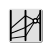
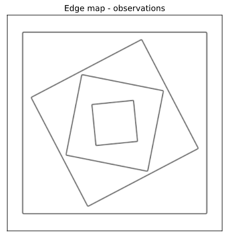
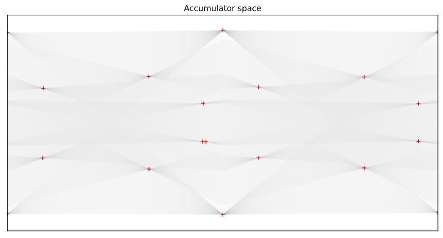
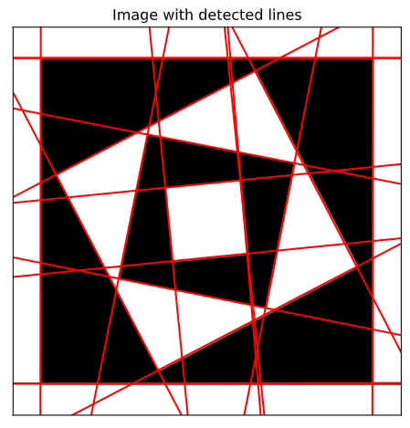

# `pclines` package for Python



This package implements a PCLines transform for line detection in images.

```bibtex
@INPROCEEDINGS{dubska2011pclines,
    author={M. {Dubská} and A. {Herout} and J. {Havel}},
    booktitle={CVPR 2011},
    title={PClines — Line detection using parallel coordinates},
    year={2011},
}
```

# Requrements

* Python 3.6+
* numpy
* numba
* scikit-image

# Installation

The package is on [PyPI](https://pypi.org/project/pclines/), so just run following command and install the package.

```shell
> pip install pclines
```

Alternatively, you can download this repository and install manually.


# Example

1. Import package

```python
import pclines as pcl
```

2. Data and observations
The observations are 2D weighted coordinates enclosed by a known bounding box. As an example we extract edge points from an image.

```python
image = imread("doc/test.png", as_gray=True)
edges = sobel(image)
r,c = np.nonzero(edges > 0.5)
x = np.array([c,r],"i").T
weights = edges[r,c]
```
 

3. Accumulation in PCLines space

```python
h,w = image.shape[:2]
bbox=(0,0,w,h)  #  Bounding box of observations
d = 1024  # Accumulator resolution
P = PCLines(bbox, d) # Create new accumulator
P.insert(x, weights) # Insert observations
p, w = P.find_peaks(min_dist=10, prominence=1.3, t=0.1) # Find local maxima
```



4. Detected lines

```python
h = P.inverse(p)  # (a,b,c) parameters of lines
X,Y = utils.line_segments_from_homogeneous(h, bbox)  # Convert to line segments for plotting
```




# Contribute

If you have a suggestion for improvement, let us know by filling an issue. Or you can fork the project and submit a pull request.

